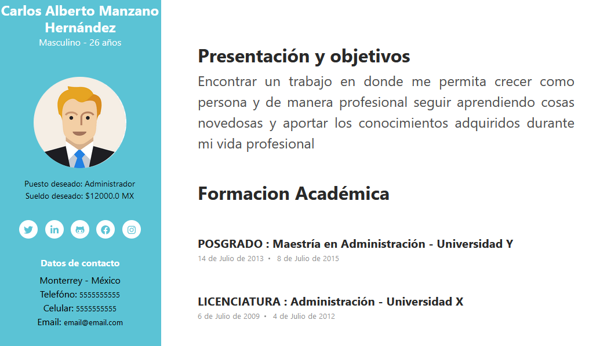
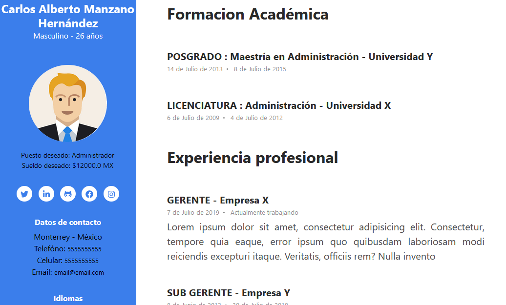

# curriculo.page-project
<a href="https://www.curriculo.page">curriculo.page</a> es una plataforma web que permite crear y generar curriculum vitae con diversas plantillas disponibles y con la posibilidad de descargar en formato PDF.

* **Diseño**

* **Diseño**

* **Diseño**

# Comentarios y observaciones
Este repositorio es una versión estándar y limitada. Puede utilizarlo, descargarlo y modificarlo.  
Sin embargo es importante considerar los siguientes puntos:  
  
  1. Carece de ciertas funcionalidades y,
  2. Puede presentar errores y/o vulnerabilidades.

*Si usted desea utilizar la versión completa y actualizada la encuentra en su sitio oficial: https://www.curriculo.page*

# curriculo.page-template
https://github.com/gab98fra/curriculo.page-template
